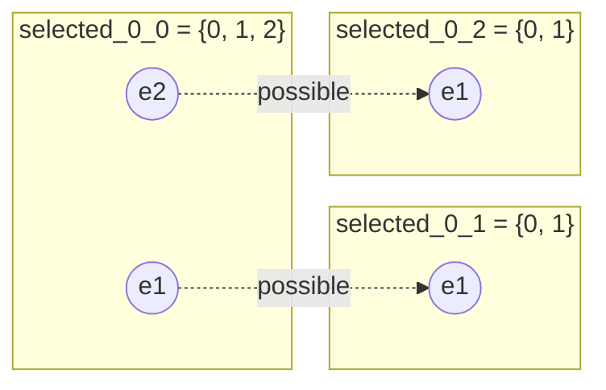
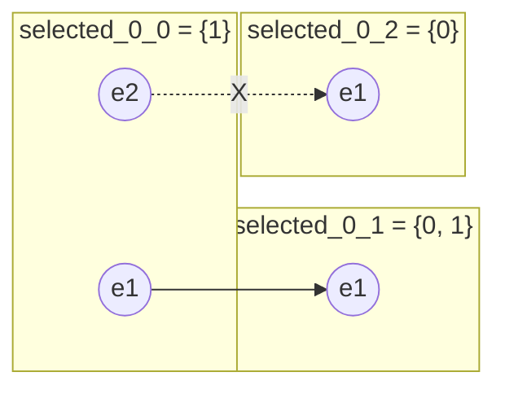
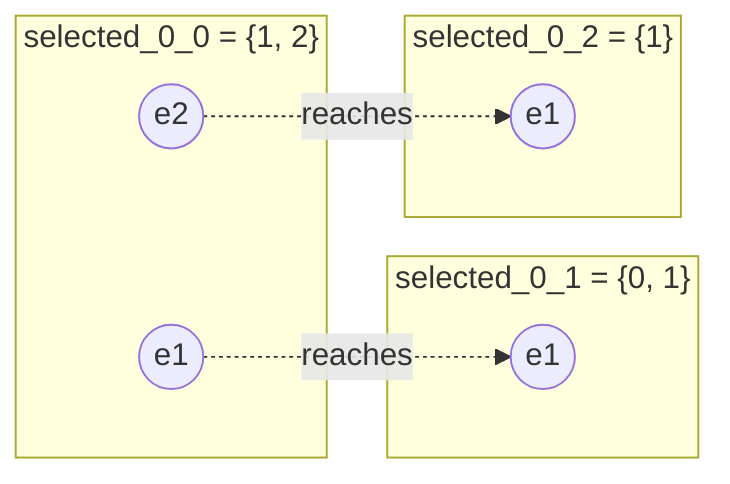
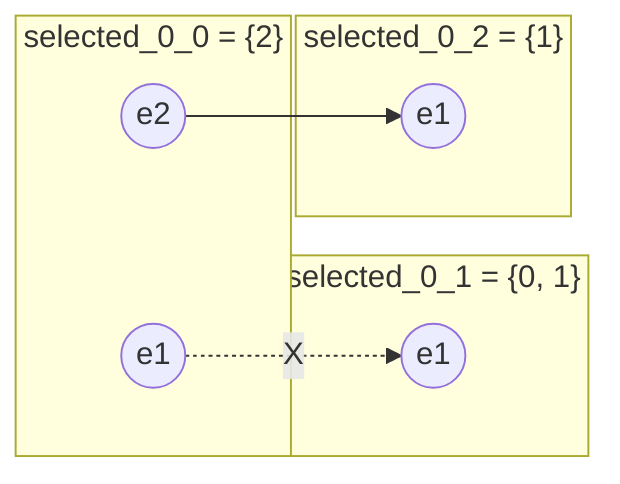
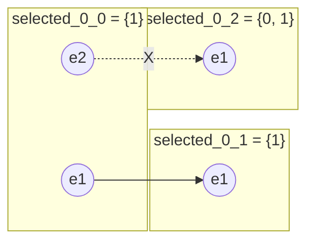
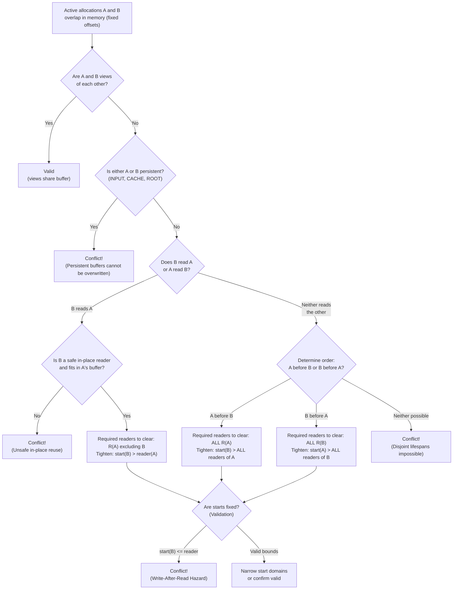
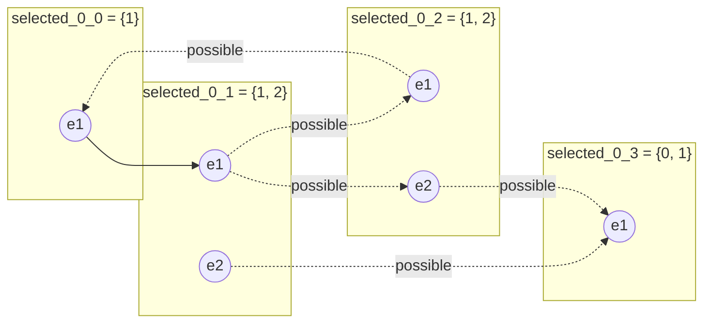
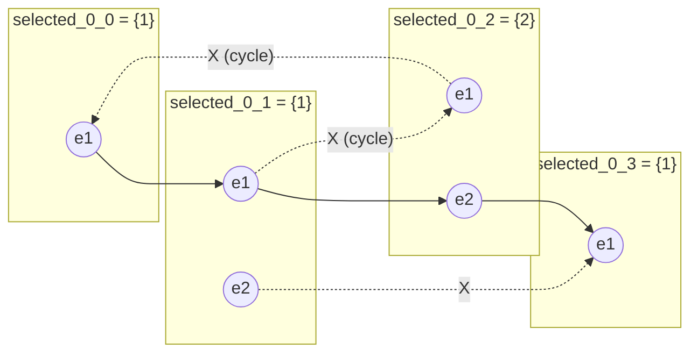

# Plan propagators

This page is the reference for the plan search propagators. The comments above each propagator class in `tensor_graphs_cpp/core/plan/propagators/` point here. A propagator narrows variable domains or reports a conflict when the current domains cannot describe a valid plan.

## Search Variable Types

Plan search operates on four types of variables (`VarType` in `tensor_graphs_cpp/core/plan/search_state.hpp`):

- **`CACHED`**: `cached_<base_e-class_id>` Binary domain `{0, 1}` indicating whether a candidate base e-class is cached across buckets (`0` = not cached, `1` = cached).
- **`SELECTED`**: `selected_<bucket_id>_<e-class_id>` Selection domain `{0, 1, ..., N}` for an e-class within a bucket, where `0` means unselected, and `1, ..., N` corresponds to selecting candidate e-node `e1, ..., eN`.
- **`START`**: `start_<bucket_id>_<e-class_id>` Integer range `[0, max_steps]` representing the dispatch step of an e-class in that bucket.
- **`OFFSET`**: `offset_<bucket_id>_<e-class_id>` Page offset range `[min_page, max_page]` representing the memory buffer allocation for an e-class in that bucket.

## Correctness

### `SelectionReachabilityPropagator`

When a selection variable changes, it may make some e-classes unreachable. Fix unreachable e-classes to `{0}`.

- **Cyclic Mode (`is_dag = false`, default):** Uses a backtrackable decremental Even-Shiloach algorithm (level labels and incoming edge pointers) to maintain single-source reachability under edge deactivations and handle cyclic components.
- **DAG Mode (`is_dag = true`):** When cycle reduction eliminates all cycles across buckets, the graph is a DAG. In DAG mode, reachability is maintained with lightweight indegree counters: deactivating an enode edge decrements the child's indegree counter. If a child's indegree reaches 0 (and it is not the root), the child is immediately unreachable, queued, and its outgoing edges are deactivated to propagate reachability loss down the DAG. On backtrack, reactivated edges increment target indegrees. Additionally, when a required e-class ($0 \notin \text{domain}$) has only one remaining active incoming parent edge/candidate, the propagator forces the parent to select that candidate to preserve reachability.

#### Example

Before selection in bucket 0, either e-node in `EClass 0` could be chosen, so both child connections are possible:

After `selected_0_0` is fixed to `1` (selecting `e1`), `EClass 2` has no connection from the selected graph and its selection is fixed to `{0}`:

### `RequiredReachabilityPropagator`

When an e-class is required ($0 \notin \text{domain}(\text{selected}_C)$), prune candidate root e-nodes that cannot reach that e-class from the root's selection domain.

- **Trigger:** Runs whenever a selection variable domain loses `0` (indicating that the e-class must be executed in that bucket), as well as during initial search propagation.
- **Index:** Statically precomputes the set of transitively reachable e-classes from each candidate e-node of the bucket root e-class (`reachable_from_root_enode_[b][en_idx]`) via BFS traversal through candidate e-nodes and child e-classes.
- **Pruning:** For any required e-class $C$, if candidate root e-node $e$ cannot reach $C$ under any downstream candidate choices, remove $e$ from $\text{selected}_{\text{root}}$'s domain. If $\text{selected}_{\text{root}}$ becomes empty, report conflict.

#### Example

Before root selection in bucket 0, either e-node in root `EClass 0` could be chosen. Candidate `e1` reaches `EClass 1`, while candidate `e2` reaches `EClass 2`:

Because `EClass 2` is required (`selected_0_2 = {1}`, with `0` not in domain), selecting candidate `e1` would leave `EClass 2` unreachable. `RequiredReachabilityPropagator` immediately prunes `1` from `selected_0_0`, fixing the root selection to `{2}`:

### `SelectionChildrenPropagator`

When an e-class is fixed to a selected e-node, every child e-class of that e-node must be selected. Remove `0` from each child's selection domain. An invalid selected e-node index is a conflict.

#### Example

Before selection in bucket 0, `EClass 1` and `EClass 2` could still be unselected (`0` in domain):

After `selected_0_0` is fixed to `1` (selecting `e1`), child `EClass 1` must be selected, so `0` is removed from its domain (`selected_0_1 = {1}`). Meanwhile, unreached `EClass 2` retains `{0, 1}` under this propagator alone:

### `UnselectedStartOffsetPropagator`

When an e-class is fixed to `{0}` (unselected), fix all its start & offset variables to `0`. These values are irrelevant for an unselected e-class.

### `CacheExclusionPropagator`

When a base e-class is fixed as not cached `{0}`, remove e-node choices selection domains of corresponding e-classes in every bucket where the e-node is any of:
-`CACHE`
-`SCATTER`
-`FUSED` with `CACHE` or `SCATTER` as root of refFactory graph

`CACHE`/`SCATTER` e-nodes can only be used when that base e-class is cached.

### `InputPruneStartPrecedencePropagator`

An e-class must start after its inputs. On start upper bound change, if 0 not in `selected_<bucket_id>_<e-class_id>`:
-For each candidate e $\in$ selected_C, if any input I $\in$ inputs(e) has start_min(I) ≥ start_max(C), remove candidate e from selected_C. if selected_C empty, return false.
-For any input I that is present in all remaining candidates of selected, start_max(I) <= start_max(C)-1

### `ConsumerStartPrecedencePropagator`

An e-class must start after its inputs. On start lower bound change, if 0 not in `selected_<bucket_id>_<e-class_id>`, for all consumers where 0 not in selected, set consumer start min to max(consumer start min, min(e-node start min for e-node in domain)) where e-node start min = max(input start min + 1 for input in e-node inputs, 0 for case with no inputs). if consumer start_min > start_max, return false.

### `StartPrecedencePropagator`

An e-class must start after its inputs. On select change, if 0 not in `selected_<bucket_id>_<e-class_id>`, set start min to max(start min, min(e-node start min for e-node in domain)) where e-node start min = max(input start min + 1 for input in e-node inputs)

### `StartUniquePropagator`

When a selected e-class's start is fixed, remove that start value from the start domains of other e-classes whose start is not fixed to {0}. This prevents two active operations from occupying the same execution step. Because we cannot represent holes in the start domain when it is a range, only remove if value is equal to min/max (maybe keep a hashmap for fast lookup of values based on min/max). But also, I want domains to be able to switch between mask and range so for example if we manage to narrow down start to a range < 32 we can swap it to a mask and then we can remove in the middle.

### `MemoryNoOverlapPropagator`

When active allocations in the same bucket and memory space have fixed offsets that overlap in physical page ranges:
$$\max(offset_A, offset_B) < \min(offset_A + size_A, offset_B + size_B)$$

Enforce physical memory safety by validating allocations and narrowing `start` domains before and during dispatch step assignments:

1. **View Aliases:** If $A$ and $B$ are views of each other (or share the same base e-class), ignore (valid alias sharing storage).
2. **Persistent Buffers:** If either $A$ or $B$ is persistent (`INPUT`, `CACHE`, or `ROOT`), report conflict (persistent buffers cannot share storage with non-view allocations).
3. **Producer-Consumer Overlap ($B$ reads $A$):**
   - If $B$ is not declared a safe in-place reader of $A$, or does not fit within $A$'s buffer ($offset_B < offset_A$ or $offset_B + size_B > offset_A + size_A$), report conflict.
   - Otherwise, $B$ must execute after $A$ and after all other readers of $A$:
     - Narrow $A$ and $B$: $\text{start}_{\min}(B) \ge \text{start}_{\min}(A) + 1$, $\text{start}_{\max}(A) \le \text{start}_{\max}(B) - 1$.
     - For every other reader $C \in R(A) \setminus \{B\}$: $\text{start}_{\max}(C) \le \text{start}_{\max}(B) - 1$, and $\text{start}_{\min}(B) \ge \text{start}_{\min}(C) + 1$.
   *(The case where $A$ reads $B$ is symmetric).*
4. **General Buffer Reuse (Neither reads the other):**
   Allocations $A$ and $B$ must have completely disjoint execution lifespans:
   - **If order is determined ($A$ precedes $B$):** $B$ can only start after ALL readers of $A$ ($R(A)$) have finished:
     $$\text{start}_{\min}(B) \ge \max_{C \in R(A)}(\text{start}_{\min}(C)) + 1$$
     And for all $C \in R(A)$: $\text{start}_{\max}(C) \le \text{start}_{\max}(B) - 1$.
   - **If order is determined ($B$ precedes $A$):** Symmetric ($A$ can only start after all readers of $B$ have finished).
   - **If order is not yet determined:** If bounds make one ordering impossible (e.g., $B$ cannot precede $A$), enforce the remaining order and narrow bounds. If neither ordering is possible, report conflict.
5. **Fixed Start Validation:** When starts are already fixed, these conditions act as conflict checks (if $start(B) \le start(A)$ or any required reader finishes at or after $B$ starts, report conflict).

### `ViewSelectOffsetPropagator`

When an e-class $V$ is fixed to a selected view e-node whose base is $B$:
- Intersect the offset domain of $V$ with the offset domain of $B$:
  $$\text{common\_min} = \max(\min(offset_V), \min(offset_B)), \quad \text{common\_max} = \min(\max(offset_V), \max(offset_B))$$
- If $\text{common\_min} > \text{common\_max}$, report conflict (disjoint allocation).
- Narrow both $offset_V$ and $offset_B$ to $[\text{common\_min}, \text{common\_max}]$. Any narrowing of $offset_B$ queues offset updates to all other aliases via the solver worklist.

### `ViewToBaseOffsetPropagator`

When the offset domain of view e-class $V$ narrows:
- **Confirmed view:** If $V$ is fixed to a view of base $B$, narrow $offset_B$ to $[\max(\min(offset_B), \min(offset_V)), \min(\max(offset_B), \max(offset_V))]$. Disjoint ranges report a conflict.
- **Unconfirmed candidate view:** For each candidate view e-node in $V$ with candidate base $B$, if $offset_V$ and $offset_B$ have disjoint domains, remove that e-node from $selected_V$'s domain. If $selected_V$ becomes empty, report conflict.

### `BaseToViewOffsetPropagator`

When the offset domain of base e-class $B$ narrows:
- **Confirmed views:** For every confirmed view $V$ of $B$, narrow $offset_V$ to $[\max(\min(offset_V), \min(offset_B)), \min(\max(offset_V), \max(offset_B))]$. Disjoint ranges report a conflict.
- **Unconfirmed candidate views:** For every candidate view consumer $V$ of $B$, if $offset_V$ and $offset_B$ have disjoint domains, remove the view e-node pointing to $B$ from $selected_V$'s domain. If $selected_V$ becomes empty, report conflict.

### `PearceKellyCyclePropagator`

When a selection is fixed to a nonzero e-node, check the dependency graph formed by the other fixed nonzero selections for a cycle. Reject a selection that closes a cycle.

### `CycleAvoidancePropagator`

Proactively prunes candidate e-nodes from selection domains across the E-graph that would close a directed cycle with currently fixed selections.

While `PearceKellyCyclePropagator` acts reactively (detecting a cycle only after a cyclic selection is branched on, causing hyperbox pruning during search diving), `CycleAvoidancePropagator` removes cyclic candidate e-nodes before branching can explore them.

#### Invariant and Mechanism

In a valid execution plan, the directed graph formed by selected e-nodes and their children must be a Directed Acyclic Graph (DAG). Let $G_{\text{fixed}}$ be the directed dependency graph formed by all currently fixed nonzero selections in bucket $b$, where a fixed selection in e-class $P$ pointing to child e-class $C$ defines a directed edge $P \to C$.

- **Acyclic Selection Invariant:** If there is a directed path from e-class $U$ to e-class $V$ in $G_{\text{fixed}}$ ($U \leadsto V$), then $V$ (or any descendant of $V$) cannot select an e-node that has $U$ (or any ancestor of $U$) as a child. Choosing such an e-node would introduce a back-edge and close a directed cycle:
  $$U \leadsto V \to \dots \to U$$

#### Incremental Propagation Algorithm

1. **Trigger:** Runs whenever a selection variable `selected_<bucket_id>_<e-class_id>` becomes fixed to a nonzero candidate $e^*$ ($e^* \ge 1$).
2. **Path Reachability:**
   - Fixing $P \mapsto e^*$ adds directed edges $P \to C_i$ for each child $C_i \in \text{children}(e^*)$.
   - Compute the ancestors of $P$ in $G_{\text{fixed}}$: $\text{Anc}(P) = \{ A \mid A \leadsto P \}$.
   - For each child $C_i$, compute its descendants in $G_{\text{fixed}}$: $\text{Desc}(C_i) = \{ D \mid C_i \leadsto D \}$.
   - Every ancestor $A \in \text{Anc}(P)$ now reaches every descendant $D \in \text{Desc}(C_i)$ via $A \leadsto P \to C_i \leadsto D$.
3. **Domain Pruning:**
   - For each descendant $D \in \text{Desc}(C_i)$ whose selection variable is not yet fixed:
     - For each candidate e-node $e_D \in \text{selected}_D$:
     - If $\text{children}(e_D) \cap \text{Anc}(P) \neq \emptyset$, candidate $e_D$ would close a cycle. Remove $e_D$ from $\text{selected}_D$'s domain:
       $$\text{selected}_D \leftarrow \text{selected}_D \setminus \{e_D\}$$
   - If any selection domain becomes empty, report conflict.
   - Queue any narrowed selection variables to the solver worklist to immediately trigger subsequent propagations (such as reachability, children, and start precedence).

#### Example

Consider four e-classes in bucket 0:
- `EClass 0` is fixed to `1` (selecting `e1`, which requires child `EClass 1`).
- `EClass 1` has domain `{1, 2}`: `e1` requires child `EClass 2` (realized by candidate `e1` or `e2`); `e2` requires child `EClass 3`.
- `EClass 2` has domain `{1, 2}`: `e1` requires child `EClass 0`; `e2` requires child `EClass 3`.
- `EClass 3` is a terminal leaf operation.

Before `selected_0_1` is fixed, both choices in `EClass 1` and `EClass 2` are possible:

When search fixes `selected_0_1 = {1}` (selecting `e1`, which requires child `EClass 2`):
- `EClass 0` $\in \text{Anc}(\text{EClass 1})$ and `EClass 2` $\in \text{Desc}(\text{EClass 2})$.
- Candidate `e1` in `EClass 2` has child `EClass 0`, which would close the cycle `0 -> 1 -> 2 -> 0`.
- **Under `PearceKellyCyclePropagator` alone:** `selected_0_2` remains `{1, 2}`. Later, search branches on `selected_0_2 = {1}`, dives into the left hyperbox, detects the cycle, and prunes the node.
- **Under `CycleAvoidancePropagator`:** As soon as `selected_0_1` is fixed, the propagator discovers that candidate `e1` in `EClass 2` consumes ancestor `EClass 0` and removes `1` from `selected_0_2`. Combined with `SelectionChildrenPropagator` removing `0` from required children, `selected_0_2` is immediately fixed to `{2}` without branching!

### `ParentRemovalPropagator`

When an e-class is fixed unselected, remove every parent e-node that requires it from the parent's selection domain. This is the contrapositive of `SelectionChildrenPropagator`.

### `CacheRequirementPropagator`

When a selected e-node is `CACHE` or `SCATTER`, require its corresponding base e-class to be cached. In the reference-factory graph, a fused e-node with a `SCATTER` root also requires caching.

### `CachedOffsetAllocationPropagator`

When a cache variable is fixed to `1`, assign its offset variables the same stable arena range in every bucket. Respect preallocated pages, offset-domain bounds, memory-space capacity, and the ranges already assigned to other active caches. If any corresponding offset is already fixed, synchronize the rest to that offset; otherwise append the allocation after the existing active cached ranges.

## Search pruning and allocation

### `CriticalPathPropagator`

After selection changes, recompute the per-bucket critical path bottom-up as the selected operation cost plus the maximum child critical path. Raise the bucket lower bound to at least this value and reject the state when the lower bound exceeds the incumbent. Only initialize after we have an incumbent.

### `CacheBudgetPropagator`

Sum of sizes of cached vars in a given mem space must be less than that space's memory cap. On cache selection, check sum < cap.

### `EarlyCacheBudgetPropagator`

Sum of sizes of cached vars in a given mem space must be less than that space's memory cap. On cache selection, for any unfixed cache vars if size > (cap - sum) then remove 1 from that var's domain.

### `EngineWorkloadPropagator`

Maintain selected work per execution engine and bucket. Raise each bucket's lower bound to at least its largest engine workload, and reject the state if that lower bound exceeds the incumbent.

### `CachedOffsetPropagator`

For a base e-class fixed as cached, all corresponding offset variables across buckets must use the same page offset. A fixed offset is copied to the other buckets; conflicting fixed or restricted domains are a conflict. When caching is required, reuse any already fixed corresponding offset.

### `WriteAfterReadStartPropagator`

When a selected start variable becomes fixed, inspect active allocations with overlapping fixed offsets whose start domains already establish an order. If the later allocation does not read the earlier one, raise its minimum start to after the earliest last reader of the earlier allocation. This performs the reader ordering before branching on individual starts.
